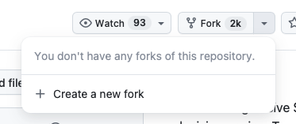
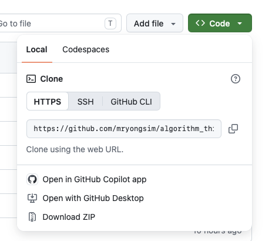
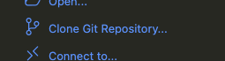
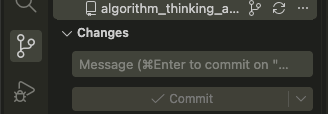
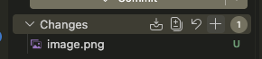

# algorithm_thinking_a2_structure

## Intro
This provides some basic structure for those trying to get assessment 2 working.

## Requirements
If running locally you will need:
1. [python](https://www.python.org/downloads/) installed - I suggest python 3+

2. either just write your code with an online editor (eg https://python-playground.com/) or

3. Get an IDE, [vscode](https://code.visualstudio.com/) is very good. if you use vscode i suggest you install some extensions such as Python, Python debugger, Pylance, it'll make your coding experience better

4. Get familiar with the command line if you're using an IDE so you can run your code from there

5. You don't strictly have to install [git](https://git-scm.com/install/mac) but it's a good idea and again, will make your life easier. follow the setup [guide](https://git-scm.com/book/ms/v2/Getting-Started-First-Time-Git-Setup)
> [!Note]
> git is a tool that allows you to interact with a version control system. 
> Github is one of a well one hosting service that provide online storage (for a version control repository) and collaboration.

> [!Tip]
> I rarely have use git on the command line if you're using vs code and i still struggle with some of the more complex ones, at which point claude is super helpful
> But here are some useful commands:
> `git clone [repo_link]` - clones a repository [repo_link] to your local machine.
> `git pull` - pulls any update from the repository
> `git push` - pushes your changes to the repository


6. If you don't have an account I strongly suggest you create one with [Github](https://git-scm.com/install/mac). It's free and it'll save you the hassle of dealing with version control.
> [!^Tip]
> Your repository can be private.
> If you're signing up - fork a copy of the repo
>
> 


## Steps to get started
I'm going to assume you're doing this locally, in VS Code and have the above setup to go
1. Fork my repo to yours, go to [this repo](https://github.com/mryongsim/algorithm_thinking_a2_structure) and click on the Fork button. Save a copy repo to your personal account and you can edit as you see fit.

2. click on the green Code button and copy the url



3. Open VS Code and you'll see an option to clone a git repository. Click it an paste the url you copied earlier. it'll ask you where to save a copy. Note that it will create a folder by itself




## File structure
It's pretty clear from the list but if not we have:
* generator - the generator code for generating the data + writing to file
* competitor - the competitor code
* max_heap - the max heap code
* experiment_1.py - the first experiment with some basic setup

For each experiment you should write a different file so it's easy to keep them separated

## How to
1. I suggest you write the code for generator, competitor, max_heap first
2. Then write experiment 1 and test them out
3. To test, in your command line/terminal you can run (in vs code you can open it up from the menu, and it should open in the current directory)
```
python3 experiment_1.py
```

## Saving to git
1. In VS Code you can click on this 'route' looking tool (source control) and you can see your changes 



2. Mouse over Changes (or any of the file) and click the plus. This will add the file(s) to be staged for commiting


3. Add a comment (you always need to) and click Commit. *This is not done yet!*
At this stage your code is commited but not actually push to the github - it's still just on your machine

4. Click Push

## python basics
[CodeDex](https://www.codedex.io/python) or [grok](https://groklearning.com/course/python-for-beginners/)

If you don't know python it's probably a good idea to do some basic lessons. if you're using the above lessons I suggest you at least learn about:
- basic
- variable
- loop
- list
- functions
- classes - this last bit is how I've kind of structured the code.

### tips
- python really cares about indents. if your code doesn't look right you're probably not indenting correctly.
- import is used to import code from another file or modules (which is basically just a group of files). There's some prebuilt ones and I think in here i've used `random` and `pathlib` only.
